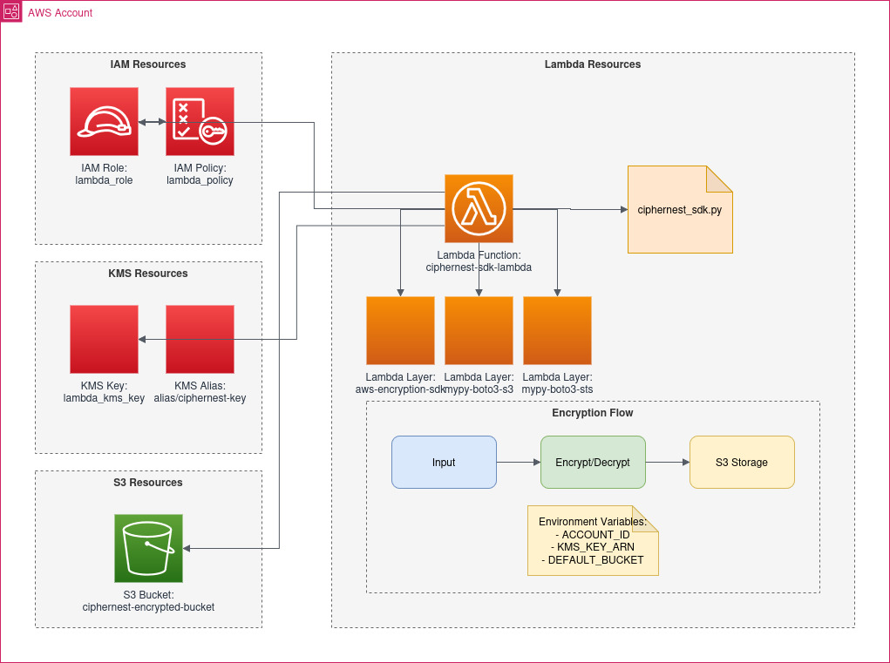

## Description

This module deploys a lambda function which encrypts / decrypts inputted data with an encryption context partially defined by a request producer, and a data encryption key derived from a customer defined key in KMS. 

The lambda pushes and pulls the encrypted secret from an owned S3 bucket accessible via the root management account or in the runtime context of the owned account. 

The module outputs the lambda role and function, plus an encryption/decryption test within the generated s3 bucket.

## Diagram


## Requirements

| Name | Version |
|------|---------|
| <a name="requirement_aws"></a> [aws](#requirement\_aws) | >= 4.16 |

## Providers

| Name | Version |
|------|---------|
| <a name="provider_archive"></a> [archive](#provider\_archive) | n/a |
| <a name="provider_aws"></a> [aws](#provider\_aws) | >= 4.16 |

## Modules

No modules.

## Resources

| Name | Type |
|------|------|
| [aws_iam_policy.lambda_policy](https://registry.terraform.io/providers/hashicorp/aws/latest/docs/resources/iam_policy) | resource |
| [aws_iam_role.lambda_role](https://registry.terraform.io/providers/hashicorp/aws/latest/docs/resources/iam_role) | resource |
| [aws_iam_role_policy_attachment.lambda_attach](https://registry.terraform.io/providers/hashicorp/aws/latest/docs/resources/iam_role_policy_attachment) | resource |
| [aws_iam_role_policy_attachment.lambda_basic_execution](https://registry.terraform.io/providers/hashicorp/aws/latest/docs/resources/iam_role_policy_attachment) | resource |
| [aws_kms_alias.lambda_kms_key_alias](https://registry.terraform.io/providers/hashicorp/aws/latest/docs/resources/kms_alias) | resource |
| [aws_kms_key.lambda_kms_key](https://registry.terraform.io/providers/hashicorp/aws/latest/docs/resources/kms_key) | resource |
| [aws_lambda_function.ciphernest_sdk](https://registry.terraform.io/providers/hashicorp/aws/latest/docs/resources/lambda_function) | resource |
| [aws_lambda_layer_version.aws_encryption_sdk](https://registry.terraform.io/providers/hashicorp/aws/latest/docs/resources/lambda_layer_version) | resource |
| [aws_lambda_layer_version.mypy_boto3_s3](https://registry.terraform.io/providers/hashicorp/aws/latest/docs/resources/lambda_layer_version) | resource |
| [aws_lambda_layer_version.mypy_boto3_sts](https://registry.terraform.io/providers/hashicorp/aws/latest/docs/resources/lambda_layer_version) | resource |
| [aws_lambda_permission.allow_invoke_lambda](https://registry.terraform.io/providers/hashicorp/aws/latest/docs/resources/lambda_permission) | resource |
| [aws_s3_bucket.ciphernest_bucket](https://registry.terraform.io/providers/hashicorp/aws/latest/docs/resources/s3_bucket) | resource |
| [aws_s3_bucket_ownership_controls.ciphernest_bucket](https://registry.terraform.io/providers/hashicorp/aws/latest/docs/resources/s3_bucket_ownership_controls) | resource |
| [aws_s3_bucket_policy.ciphernest_bucket](https://registry.terraform.io/providers/hashicorp/aws/latest/docs/resources/s3_bucket_policy) | resource |
| [aws_s3_bucket_public_access_block.ciphernest_bucket](https://registry.terraform.io/providers/hashicorp/aws/latest/docs/resources/s3_bucket_public_access_block) | resource |
| [aws_s3_bucket_versioning.ciphernest_bucket](https://registry.terraform.io/providers/hashicorp/aws/latest/docs/resources/s3_bucket_versioning) | resource |
| [archive_file.ciphernest_sdk_zip](https://registry.terraform.io/providers/hashicorp/archive/latest/docs/data-sources/file) | data source |
| [aws_caller_identity.current](https://registry.terraform.io/providers/hashicorp/aws/latest/docs/data-sources/caller_identity) | data source |
| [aws_region.current](https://registry.terraform.io/providers/hashicorp/aws/latest/docs/data-sources/region) | data source |

## Inputs

| Name | Description | Type | Default | Required |
|------|-------------|------|---------|:--------:|
| <a name="input_prefix"></a> [prefix](#input\_prefix) | Unique prefix for ciphernest | `string` | `"ciphernest"` | no |

## Outputs

| Name | Description |
|------|-------------|
| <a name="output_lambda"></a> [lambda](#output\_lambda) | Lambda role information |

## Usage
1) Environment level tf file: 
ciphernest.tf
```hcl
   module "ciphernest" {
     source  = "insightsoftmax.jfrog.io/terraform__isc/ciphernest/isc"
     version = "~> 0.1"
     prefix  = "default" # optional: namespace prefix the aws resources generated for s3, kms, and lambda 
   }
```
